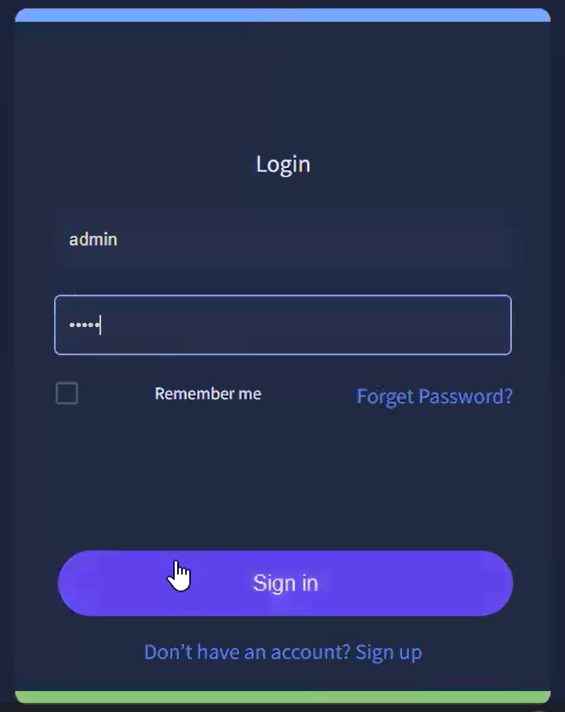
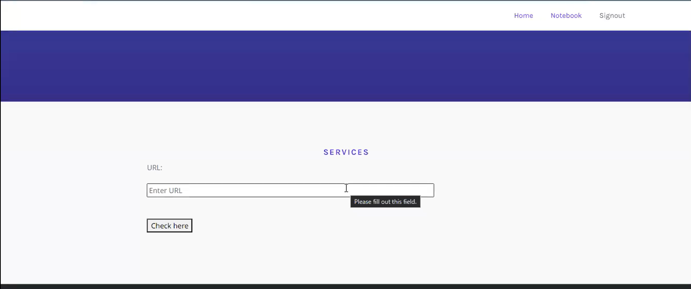
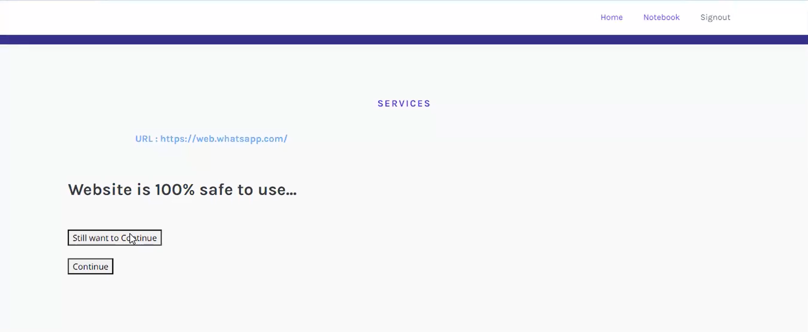
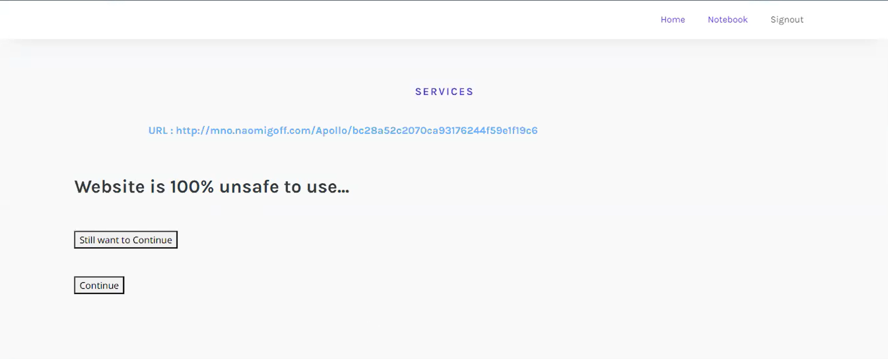

# Phishing Detection System Through Hybrid ML Based on URL

A Flask web application that analyzes a submitted URL and predicts whether it is likely legitimate or a phishing risk. The project combines URL feature extraction, a trained machine-learning model, a simple authentication flow, and a web frontend for checking URLs.

## Project Links

- Repository: [GitHub project](https://github.com/irum13/Phishing-Detection-System-Through-Hybrid-ML-Based-on-URL-)
- Notebook preview: [View `org.ipynb` on nbviewer](https://nbviewer.org/github/irum13/Phishing-Detection-System-Through-Hybrid-ML-Based-on-URL-/blob/main/org.ipynb)
- Notebook runtime: [Open `org.ipynb` in Google Colab](https://colab.research.google.com/github/irum13/Phishing-Detection-System-Through-Hybrid-ML-Based-on-URL-/blob/main/org.ipynb)
- Frontend app: run the Flask frontend locally and open [http://127.0.0.1:5000](http://127.0.0.1:5000)

## Frontend Access

The project includes a working Flask frontend for checking URLs.

- Local frontend: [http://127.0.0.1:5000](http://127.0.0.1:5000) after running `python app.py`
- URL checker page: [http://127.0.0.1:5000/url](http://127.0.0.1:5000/url)
- Deploy online: [](https://render.com/deploy?repo=https://github.com/irum13/Phishing-Detection-System-Through-Hybrid-ML-Based-on-URL-)

After deploying, replace this line with the public app URL:

```text
Live frontend: https://your-render-app-name.onrender.com
```

## What the App Does

- Accepts a URL from the web frontend.
- Extracts 30 URL, domain, and webpage features.
- Loads the trained model from `model.pkl`.
- Predicts whether the URL is likely safe or suspicious.
- Displays safe and phishing probability scores.
- Includes signup and login pages backed by SQLite.

## Tech Stack

- Python 3.10
- Flask
- scikit-learn
- imbalanced-learn
- NumPy and pandas
- BeautifulSoup, requests, whois, and googlesearch-python
- SQLite
- Bootstrap frontend templates

## Run the Frontend Locally

1. Clone the repository:

   ```sh
   git clone https://github.com/irum13/Phishing-Detection-System-Through-Hybrid-ML-Based-on-URL-.git
   cd Phishing-Detection-System-Through-Hybrid-ML-Based-on-URL-
   ```

2. Create and activate a Python 3.10 virtual environment:

   ```sh
   python -m venv .venv
   .venv\Scripts\activate
   ```

   On macOS or Linux:

   ```sh
   python3.10 -m venv .venv
   source .venv/bin/activate
   ```

3. Install dependencies:

   ```sh
   pip install -r requirements.txt
   ```

4. Start the Flask app:

   ```sh
   python app.py
   ```

5. Open the frontend:

   [http://127.0.0.1:5000](http://127.0.0.1:5000)

## Main App Pages

- Home: `/`
- URL checker: `/url`
- About: `/about`
- Notebook links: `/notebook`
- Signup: `/signup`
- Login: `/login`

## Notebook

The training and experimentation notebook is included as [`org.ipynb`](org.ipynb).

Use these links if GitHub does not render the notebook directly:

- [View notebook on nbviewer](https://nbviewer.org/github/irum13/Phishing-Detection-System-Through-Hybrid-ML-Based-on-URL-/blob/main/org.ipynb)
- [Run notebook in Google Colab](https://colab.research.google.com/github/irum13/Phishing-Detection-System-Through-Hybrid-ML-Based-on-URL-/blob/main/org.ipynb)

## Machine Learning Workflow

The project workflow includes:

1. Data collection from phishing and legitimate URL datasets.
2. Feature extraction from URL structure, domain metadata, links, redirects, and page content.
3. Data preprocessing and train-test splitting.
4. Model training and comparison.
5. Saved-model prediction through the Flask frontend.

## Algorithms Explored

| Algorithm | Purpose |
| --- | --- |
| Logistic Regression | Baseline classification model |
| Decision Tree | Tree-based URL classification |
| Random Forest | Ensemble model for stronger classification |
| Support Vector Machine | Boundary-based classification |
| Naive Bayes | Probabilistic baseline model |
| Gradient Boosting | Boosted ensemble classifier |
| Hybrid LSD | Voting-style hybrid approach using LR, SVM, and Decision Tree ideas |
| Stacking Classifier | Ensemble stacking with RF, MLP, and LightGBM |

## Screenshots

### Home Page


### User Signup


### User Login



### URL Search Page



### URL Result Page 1



### URL Result Page 2



## Important Notes

- Use Python 3.10 for best compatibility with the saved `model.pkl`.
- The model was saved with an older scikit-learn version, so `requirements.txt` pins compatible ML packages.
- This app is an educational phishing-detection project and should not be used as the only security decision system.
- Some feature extraction methods depend on external websites, WHOIS data, DNS lookups, and search results, so predictions can vary with network availability.

## Future Improvements

- Deploy the Flask app publicly and replace the placeholder frontend URL with the production link.
- Add password hashing for production-safe authentication.
- Add automated tests for routes, feature extraction, and prediction behavior.
- Retrain and export the model with the latest stable scikit-learn version.
- Add API endpoints for integration with browser extensions or security tools.
